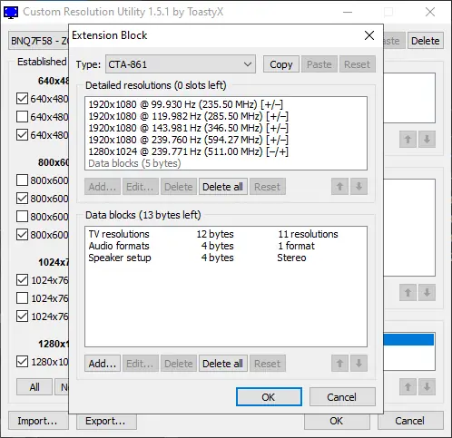
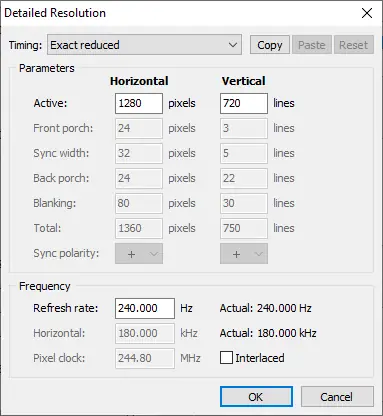
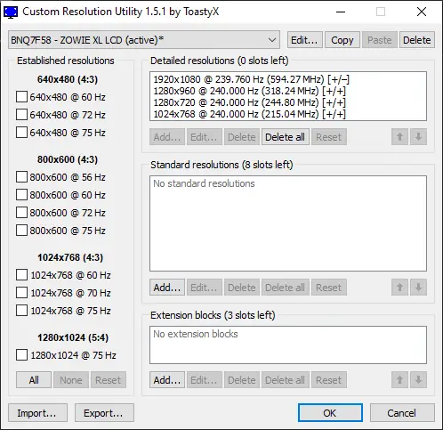

`DISLAIMER: If your monitor has a physical G-SYNC module you will most likely not be able to setup display scaling, at least that was my case with the PG27AQN. Don't get this messed up with "G-SYNC Compatible", you are able to setup display scaling with such monitors without any issues.`

This guide will cover how to make your monitor scale non-native resolutions instead of your GPU, which will result in sharper image[^3] and negligible[^1] latency improvement. Setting this up can also fix the issue with games changing your monitor's refresh rate.

Plus:
- Sharper image[^3]
- Eliminates games changing refresh rate
- Negligible latency improvement[^1]

Minus:
- Longer Alt+Tab[^2]
- Doesn't work on monitors with physical G-SYNC module (read disclaimer above)

Prerequisites:
- [CRU (Custom Resolution Utility)](https://www.monitortests.com/forum/Thread-Custom-Resolution-Utility-CRU)

Download Custom Resolution Utility (further only as CRU) and extract it. The archive will contain other useful programs[^4]. Keep all of them, they are "necessary" in the process of setting up and getting you recovered if anything goes wrong.

Open CRU, click and open the Default extension block at the lower half of the program and you will see a list of resolutions: 

`If the resolution you want to use is above 655.35 MHz pixel clock (~280hz @ 1080P), you will have to add your resolutions in an extension block - Display ID 1.3 (or 2.0)`[^5]

Click on your native resolution (e.g. 1920x1080@240), open it and click copy in the top right, exit out and click add in detailed resolutions (or in an extension block -> detailed resolutions, read above), then paste at the top right.

Now you can delete other resolutions and/or unnecessary extension blocks. Only keep your newly added native resolution.

Now add the resolution you play on in the detailed resolutions tab (or extension block as described above) and use timing - `Exact reduced`:

Exit out of CRU by clicking OK and run `restart64.exe`[^4] as an administrator, if anything goes wrong and you don't see any image press `F8`. This will make your monitor switch into safe mode and you will be able to adjust the settings or reset[^4] back to the defaults.

Make sure you either have `Aspect Ratio` or `No scaling` set in your GPU's control panel, otherwise display scaling won't work[^6]. You can always use your monitor's OSD or Windows Settings to check if display scaling is working by checking your active resolution. If for example you are using 1280x720 in-game and the active resolution reports 1920x1080, this means that display scaling is not working.

Use your monitor's OSD to change the way the image gets scaled. You can usually find it under `Picture mode`, `Picture format` or similar.

Tip:[^2] If you hate the longer Alt+Tab times, you can completely eliminate this extra delay by changing your desktop resolution to the one you are using in-game. Read the footnote for more information.

If you are still struggling with getting display scaling to work, try reading through the thread on Monitor Tests forums or watch this YouTube video made by [KajzerD](https://www.youtube.com/c/KajzerD), I've included both below.

> https://www.monitortests.com/forum/Thread-Custom-Resolution-Utility-CRU

> https://youtu.be/50itBs-sz1w

[^1]: Different sources state that making your display scale your non-native resolutions gives you a negligible input latency improvement, due to the fact that the GPU could be adding a tiny bit of delay (<1ms), take this with a grain of salt.

[^2]: If your desktop and in-game resolutions are mismatched it will take longer to alt+tab due to your monitor having to change it's resolution mode everytime you exit to desktop (e.g. 1280x720 -> 1920x1080). This can be completely eliminated by changing your desktop resolution to the one you are using in-game. Make sure you change the resolution with your GPU's control panel, changing the resolution in Windows Settings does not change it properly.

[^3]: How sharp the image is gonna be depends on the quality of your monitor's scaler. Different monitors will bring different results. I tried this on my Zowie XL2546 and Asus XV252Q and the image was significantly sharper on the Zowie.

[^4]: reset-all.exe - resets all monitor settings back to default; restart64.exe - restarts gpu drivers + opens recovery menu.

[^5]: I recommend you to use Display ID 1.3 since it has better compatibility.

[^6]: For example if you were to use full panel scaling inside your GPU panel, it would override your monitor's scaling completely, forcing your GPU to scale the image.